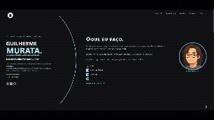

# Murata Personal Site

Olá! Aqui é o Murata. Esta é a versão 2 do meu site de portfólio, uma reescrita completa da versão 1, que, vergonhosamente, é um modelo que tentei fazer ano passado utilizando bootstrap e ficou horrivel. Eu queria experimentar o que posso fazer por conta própria em relação ao design de UI e UX, então achei que por que não começar com meu portfólio.

Ele foi escrito em Typescript usando [Next.js](https://nextjs.org/), com a ferramente SSG também. Ele utiliza o [ChakraUI](https://chakra-ui.com/) e o [Framer Motion](https://www.framer.com/motion/) para as animações.

O site está atualmente implantado no <b>Vercel</b>.

## Demo



> Build Status 

[Vercel Status](https://portfoliomurata-laqrso6nv-muratas-projects-a7f0e663.vercel.app/)


## Local Development

Este é apenas um projeto [Next.js](https://nextjs.org/) inicializado com [`create-next-app`](https://github.com/vercel/next.js/tree/canary/packages/create-next-app).

Use pelo menos o Node v12, mas a versão recomendada é o Node v14 LTS. Há um `.nvmrc`, você pode executar o `nvm use` se tiver o nvm instalado.

## Getting Started

Este projeto favorece fortemente o <b>yarn</b> em relação ao npm.

Portanto, para configurar as coisas, você precisa executar:

```bash
yarn install
```
or just
```bash
yarn
```

Em seguida, para executar o servidor de desenvolvimento:

```bash
yarn dev run
```

E ele deverá abrir em:

> http://localhost:3000/